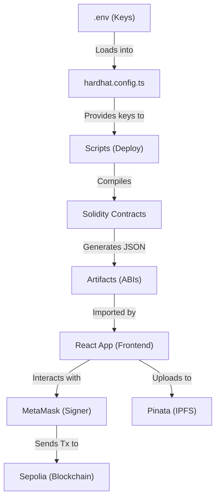

# 🎓 Step-by-Step Tutorial: Building a Premium NFT Marketplace

Welcome! You've successfully built a world-class NFT Marketplace. This guide will walk you through exactly how it was done, so you can master the skills of "vibe-coding" and Web3 development.

---

## Phase 1: The Foundation (Smart Contracts)

We built two essential contracts using **Solidity**:

### 1. `NFT.sol`
This is an **ERC-721** contract (the standard for NFTs).
- **Key Feature**: We used OpenZeppelin's `ERC721URIStorage` to allow each NFT to have a unique "URI" (a link to its metadata/image on IPFS).
- **The Mint Function**: It takes a `tokenURI` and assigns it to a new `tokenId`, giving ownership to the person who called the function.

### 2. `Marketplace.sol`
This handles the logic for buying and selling.
- **Listing**: The seller "approves" the marketplace to handle their NFT, then we record the price and ownership.
- **Buying**: The marketplace takes the buyer's ETH, keeps a small fee (1%), sends the rest to the seller, and transfers the NFT to the buyer.
- **Security**: We used `ReentrancyGuard` to prevent "reentrancy attacks" where someone might try to steal funds by calling a function multiple times before the first one finishes.

---

## 🔑 The Mystery of Private Keys (Where is the Signing?)

You asked: *"Where does it use my private key to sign?"*. This is the most critical part of blockchain security. Here is the path your key takes:

### 1. The `.env` Safe
Your key starts in the `.env` file. It's kept here so it's never accidentally uploaded to GitHub.
```env
PRIVATE_KEY=0xYourSecretKey...
```

### 2. The `hardhat.config.ts` Courier
Hardhat reads that key and injects it into its internal "wallet manager."
```typescript
// in hardhat.config.ts
networks: {
  sepolia: {
    url: process.env.SEPOLIA_URL,
    accounts: [process.env.PRIVATE_KEY] // <-- THE KEY ENTERS HERE
  }
}
```

### 3. The Deployment Script (`deployMarketplace.js`)
When you run the script, `ethers.getSigners()` automatically picks up the keys defined in the config.
```javascript
// in deployMarketplace.js
const [deployer] = await ethers.getSigners(); 
// 'deployer' now holds your private key internally via a "Signer" object.
```

### 4. The Final Signature
When you call `deploy()`, Ethers.js automatically takes the transaction, hashes it, and **signs it with your private key** before sending it to Alchemy.
```javascript
const nft = await NFT.deploy(); // This triggers the signature!
```

---

## 🏗️ How the Script "Sees" the Contract

JavaScript and Solidity speak different languages. To bridge them, we use the **ABI (Application Binary Interface)**. 

1. **Compile**: When you run `npx hardhat compile`, it creates a JSON file in `artifacts/contracts/NFT.sol/NFT.json`.
2. **Import**: The script uses `ethers.getContractFactory("NFT")`. This isn't importing the Solidity file; it is fetching that **JSON** file.
3. **Bridge**: The JSON tells JavaScript exactly which buttons (functions) the contract has.

---

## Phase 3: The Frontend (React & Tailwind)

This is where the "vibe" happens. We used a modern stack for maximum speed and beauty:

### 1. Setting up the "Brain" (Wagmi & RainbowKit)
In `main.jsx`, we wrapped our app in a `WagmiProvider` and `RainbowKitProvider`. This gives us the famous "Connect Wallet" button and handles all the complex logic of communicating with MetaMask.

### 2. Styling (Tailwind & Glassmorphism)
We used **Tailwind CSS** for layout and custom CSS in `index.css` for the "glass" look.
- **Trick**: Using `backdrop-blur` and gradients makes the UI feel like floating glass over a dark cosmic background.

### 3. Fetching Data (Smart Contract Interaction)
In `Marketplace.jsx`, we used **Ethers.js** to:
1. Call the marketplace contract to get the list of items.
2. Call the NFT contract to get the image link (URI).
3. Use `fetch()` to download the metadata (name, description) from **IPFS**.

---

## Phase 4: IPFS Integration (Pinata)

Blockchain storage is very expensive, so we don't store images on the blockchain. Instead, we use **IPFS** (InterPlanetary File System).
- We created `utils/pinata.js` which takes a user's image, sends it to Pinata's servers, and gives us back a **CID** (a unique ID for that file).
- We then store this CID on the blockchain. It's safe, decentralised, and cheap!

---

## How to use it now?

1. **Connect**: Click "Connect Wallet" and switch to **Sepolia**.
2. **Mint**: Go to the "Mint" page, upload a picture, and set a price.
3. **Explore**: Your NFT will appear in the main "Explore" grid!
4. **Collect**: Use a different wallet (or ask a friend) to buy your NFT.

---

## 🗺️ Project Architecture Map

Here is how all the pieces fit together:



### 1. The Signing Flow
When you see `await nft.mint(metadataURL)` in `CreateNFT.jsx`:
- **React** asks **MetaMask** to sign the transaction.
- **MetaMask** uses the **Private Key** stored in your browser wallet.
- **Alchemy** (using your `SEPOLIA_URL`) broadcasts that signed transaction to the world.

### 2. The Deployment Flow
When you run `npx hardhat run scripts/deployMarketplace.js`:
- **Hardhat** reads your `PRIVATE_KEY` from `.env`.
- **Ethers.js** creates a "Deploy Transaction."
- It signs it using that key and sends it to the blockchain.

### 3. The "Static" Files
The `MarketplaceData.json` is our "Bridge." It contains:
- **ABI**: The map of functions.
- **Address**: Where the contract actually lives on the blockchain.

---

---

## 🌍 Viewing Your NFTs on OpenSea

Yes, you can see your NFTs on OpenSea! Since we deployed to the **Sepolia Testnet**, your contract is automatically indexed by OpenSea's testnet environment.

**Your Collection Link**: 
[https://testnets.opensea.io/assets/sepolia/0x48D5D22E6656B5971933F9Ac0E2ca638E541e6B3](https://testnets.opensea.io/assets/sepolia/0x48D5D22E6656B5971933F9Ac0E2ca638E541e6B3)

### Why does this work?
OpenSea listens to all ERC-721 "Transfer" events on the blockchain. When you minted your NFT, your contract emitted a `Transfer` event. OpenSea saw it, read the `tokenURI` we stored (the IPFS link), and displayed your image!

---

### 💡 Pro Tip for Learning:
Try changing a color in `index.css` or adding a new field to the NFT minting form. The best way to learn is to "break" things and see how they fix!

**Keep building, the decentralized future is yours!** 🚀
